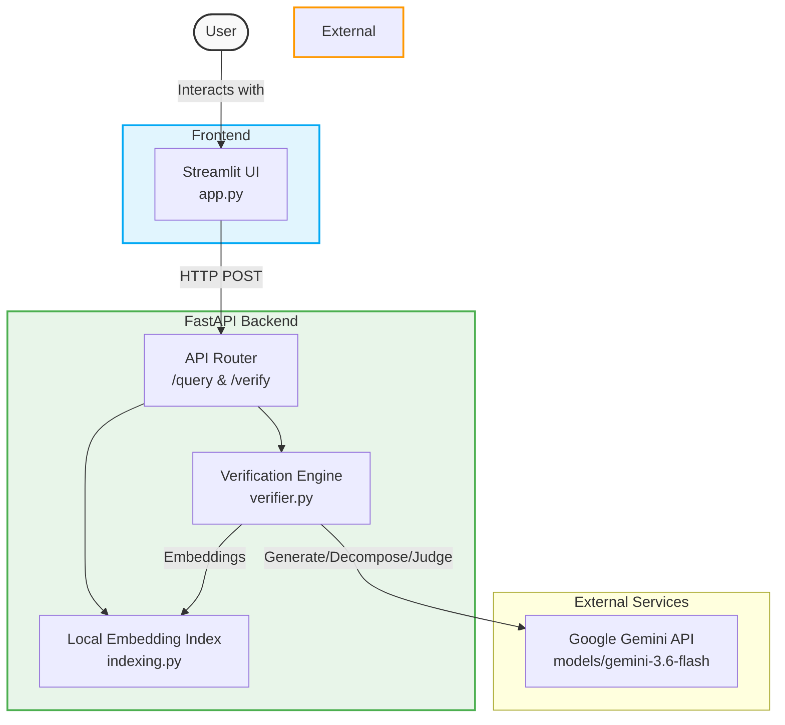
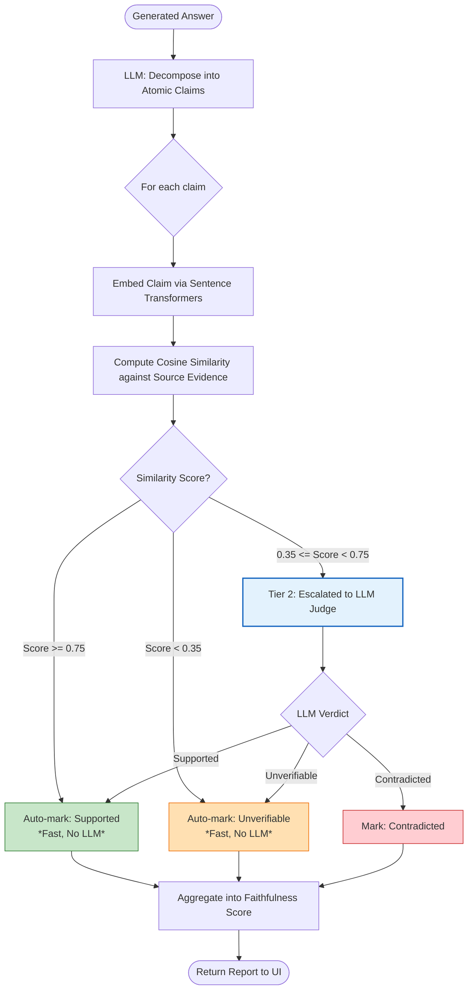

# RAG Verifier Diagrams

Here are the system architecture and workflow diagrams. You can take screenshots of these to include in your presentation, or include them directly in your GitHub repo since GitHub natively renders Mermaid diagrams!

## 1. System Architecture
This diagram shows the high-level components of your system and how they communicate.

 

## 2. Verification Workflow (The Tiered System)
This diagram maps out exactly how your clever two-tier hybrid verification system processes claims to balance cost/latency with accuracy.

